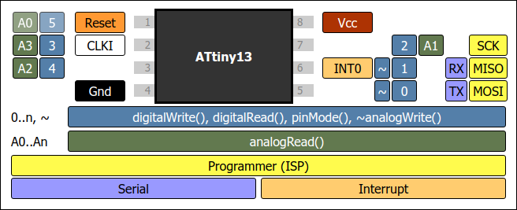
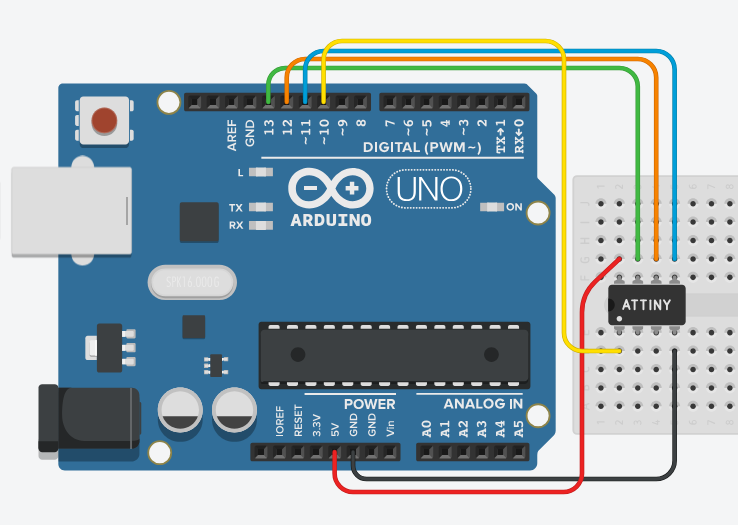
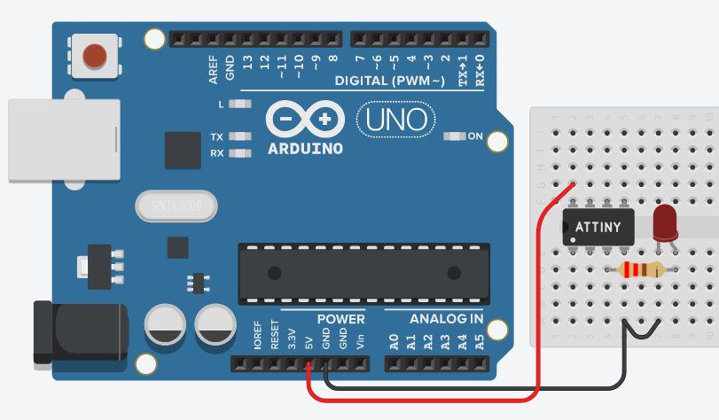

# Use ATtiny13a with Arduino Uno

## What is this

I got bored and frustrated that there is almost nothing on the internet about how to use the ATtiny13a and decided to just make this.
This is a fork of optiboot that i changed up a bit to work with the ATtiny13a and Arduino Uno more easily.
Requires Arduino IDE version 1.6.9 or above.

## How to use

### 1.) Connect your Arduino Uno with your ATtiny13a

Arduino => ATtiny13(a)
5v => Pin 8
GND => Pin 4
Pin 13 => Pin 7
Pin 12 => Pin 6
Pin 11 => Pin 5
Pin 10 => Pin 1

### 2.) Setting up the Arduino Uno as ISP

Connect your Arduino to your PC and inside the Arduino IDE go to File/Examples/11.ArduinoISP/ArduinoISP.
After the example loads just upload the code into the Arduino.

### 3.) Downloading ATtiny13a as a core/library

Open your Arduino IDE and go inside File/Preferences and inside "Additional boards manager URLs:" paste in the following url:
`https://raw.githubusercontent.com/m4vm/attiny13a-optiboot/master/dists/package_attiny13a_index.json`

After you have done that go to Tools/Board/Boards Manager and in there search for and install ATtiny13a.

### 4.) Burning the bootloader

Go to Tools/Board and select ATtiny13. After selecting it navigate to Tools/Processor Version and select either ATtiny13 or ATtiny13a depending on your chip.
Do not change any other settings unless you know what you are doing.
Important Note: You should make sure your programmer is set as "Arduino as ISP".
Finally, click the Burn Bootloader button at the bottom of the Tools menu.

### 5.) Programming the chip

If you did everything correctly you can now upload any piece of code through the Arduino IDE as long as ATtiny13a is selected as the board and is still connected to the Arduino Uno.
For example you can upload the Blink LED example just to test it.
``
void setup() {
pinMode(4, OUTPUT);
}

void loop() {
digitalWrite(4, HIGH);
delay(1000);
digitalWrite(4, LOW);
delay(1000);
}
``
It should look something like this:

### 6.) Enjoy

👍
